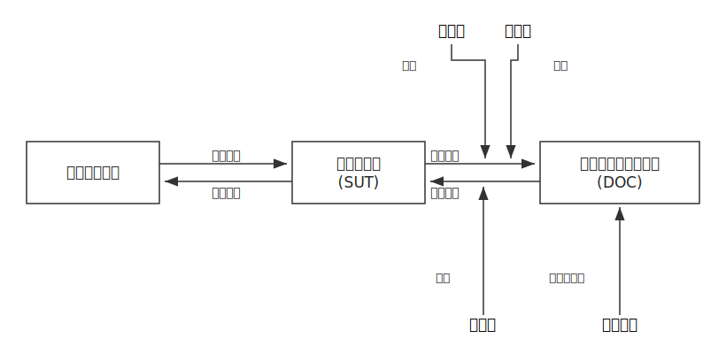

# レクチャー: テストダブル（モック・スパイ・スタブ・フェイク）

> 解説: [docs/03_basic.md](../../../docs/03_basic.md)

## このレクチャーのゴール

テスト対象が**外部の依存（DB・通信・時刻など）に頼っている**とき、その依存を
**テストダブル**という代役に差し替えて、速く・決定的にテストできるようにする。
そのうえで **スタブ／フェイク／スパイ／モック** の役割の違いを説明できるようにする。

## 前提

[../04-good-tests](../04-good-tests) を済ませていること（「決定的」にするため依存を引数で注入する考え方を使う）。

## 登場人物（用語）



> 4 つのテストダブルはいずれも **DOC（依存コンポーネント）の代役**。
> 何を制御・観測するか（間接入力を操作するのか、間接出力を検証/記録するのか）で役割が分かれる。

- **SUT（System Under Test）**: テスト対象そのもの。今回は [src/checkout.js](./src/checkout.js) の `checkout`。
- **DOC（Depended-On Component）**: SUT が頼る相手（在庫照会・注文保存・メール送信）。
- **直接入力 / 直接出力**: テストコードと SUT のやり取り（引数と戻り値・例外）。
- **間接入力 / 間接出力**: SUT と DOC のやり取り。ここをダブルで制御・観測する。

## 4 つのテストダブル

| ダブル | 図での位置 | 役割 | ひとことで |
|---|---|---|---|
| **スタブ** | 間接入力を **操作** | SUT に決まった値を返して状況を作る | 「こう答えておいて」 |
| **フェイク** | 実装の **置換** | 動くが軽量な代役（インメモリ実装など） | 「本物の簡易版」 |
| **スパイ** | 間接出力を **記録** | 呼ばれた引数を記録し、後から確認する | 「あとで履歴を見る」 |
| **モック** | 間接出力を **検証** | 期待どおり呼ばれたかを表明する | 「こう呼ばれるはず」 |

> スパイとモックは似ているが、**スパイは「実行後に記録をたどって確認」、モックは「期待を先に決めておき、外れたら失敗」** という重心の違いがある。

## 題材

- [src/checkout.js](./src/checkout.js) … 依存（`getStock` / `orderRepository` / `mailer`）を**引数で注入**する `checkout`
- [test/checkout.test.js](./test/checkout.test.js) … 4 つのダブルを 1 つずつ体現したテスト

## 手順

### 1. 依存を引数で受け取れるようにする

`checkout` は DB やメールを直接呼ばず、すべて `deps` 経由で受け取る。
これがあるからテストで代役へ差し替えられる（[04-good-tests](../04-good-tests) の「注入」と同じ発想）。

### 2. スタブで間接入力を操作する

`getStock` を `() => 100` や `() => 0` に差し替え、「在庫あり／なし」の状況を自在に作る。
実 DB を用意しなくても分岐を両方テストできる。

### 3. フェイクで実装を置換する

本番の DB の代わりに、配列へ貯めるだけの `createFakeOrderRepository()` を使う。
「動くけれど軽い」ので、保存結果を覗いて検証できる。

### 4. スパイ／モックで間接出力を観測・検証する

`node:test` の `mock.fn()` で `mailer.send` を差し替える。
- スパイ: 実行後に `send.mock.calls` をたどり、宛先・金額を確認（記録 → 後で確認）。
- モック: 期待する引数を先に書き、回数ぴったりを表明（期待 → 外れたら失敗）。

### 5. 実行する

```sh
node --test
```

## まとめ

外部依存を**注入できる設計**にしておけば、テストではダブルに差し替えて速く・決定的にできる。
- 入力側（間接入力）を操作したい → **スタブ／フェイク**
- 出力側（間接出力）を観測・検証したい → **スパイ／モック**

「何を差し替え、何を確かめたいのか」を図の上で指させると、どのダブルを使うか迷わなくなる。
